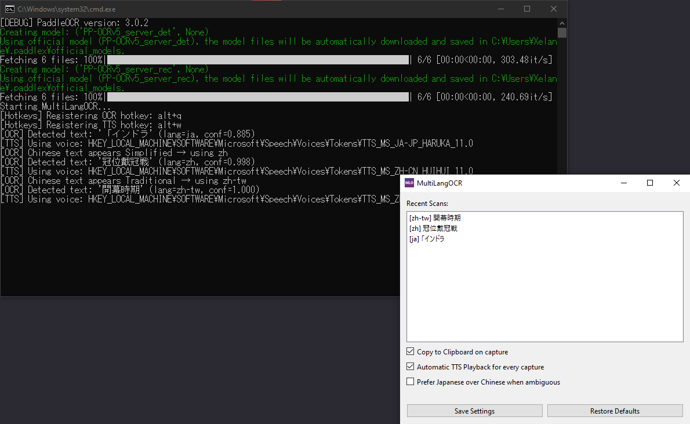
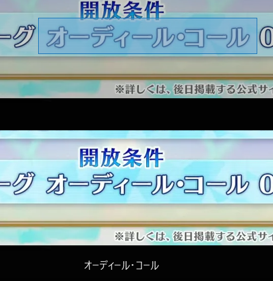

# MultiLangOCR

A Windows desktop tool for extracting text from screen regions using OCR, with automatic clipboard copying and text-to-speech playback.

## Screenshots




## Features

- Global hotkey screen capture
- OCR support for English, Japanese, Chinese (Simplified/Traditional)
- Automatic clipboard copying
- Text-to-speech playback
- Configurable settings

## Setup

**NVIDIA GPU users:**
```bash
pip install --pre paddlepaddle-gpu -i https://www.paddlepaddle.org.cn/packages/nightly/cu118/
pip install -r requirements.txt
```

**CPU users:**
```bash
pip install paddlepaddle
pip install -r requirements-cpu.txt
```

## Usage

Run `launch.bat` or:
```bash
python main.py
```

**Default Hotkeys:**
- Alt+Q → OCR scan
- Alt+W → TTS playback

## Dependencies

- PaddleOCR for text recognition
- OpenCC for Chinese character conversion
- pyttsx3 for text-to-speech
- PyQt for GUI
